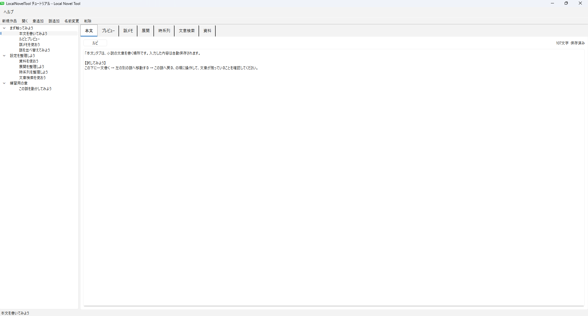

# LocalNovelTool

小説を書くことに集中するための、軽量・完全ローカルの執筆支援ツールです。

「この設定なんだっけ？」
「次の展開どうするんだっけ？」
をすぐ確認できることを重視しています。

## Download

最新版は GitHub Releases からダウンロードできます。

ZIPを展開し、`LocalNovelTool.exe` を起動するだけで使用できます。
Pythonのインストールは不要です。

## Screenshot

## 主な機能

- 作品フォルダの新規作成 / 読み込み
- 初回起動時のチュートリアル作品
- 章・話の追加 / 名前変更 / 削除
- 章・話のドラッグ＆ドロップ並び替え
- 話の別章への移動
- 本文エディタ
- 500ms自動保存
- 文字数表示
- ルビ記法 `｜白雨《しらさめ》`
- 横書き / 縦書きプレビュー
- 話メモ
- 登場人物 / アイテム / 世界観 / その他の資料管理
- 展開管理
- 時系列管理
- 本文 / 話メモ / 資料 / 展開 / 時系列の横断検索
- 検索結果から対象へ直接移動
- チュートリアル再作成
- 完全ローカル動作

## 基本的な使い方

1. 「新規作品」から作品を作成
2. 章と話を追加
3. 「本文」タブで執筆
4. 必要に応じて話メモ、資料、展開、時系列を確認
5. 「文章検索」で作品全体を横断検索

初回起動時には操作方法を確認できるチュートリアル作品が開きます。

## データ保存について

- 作品データは完全にローカルへ保存します。
- 本文はUTF-8テキストで保持します。
- 作品構造はJSONで保持します。
- アプリが使用できなくなっても本文データを直接確認できます。
- クラウド通信やAI機能は使用しません。

## 開発 / ビルド

使用技術:

- Python
- PySide6 / Qt
- pytest
- pyside6-deploy / Nuitka

Windows 10 / 11 x64向けです。詳細なビルド手順は [BUILD_WINDOWS.md](BUILD_WINDOWS.md) を参照してください。

## ライセンス

- [LICENSE.txt](LICENSE.txt)
- [THIRD_PARTY_LICENSES.txt](THIRD_PARTY_LICENSES.txt)
- [CREDITS.txt](CREDITS.txt)
