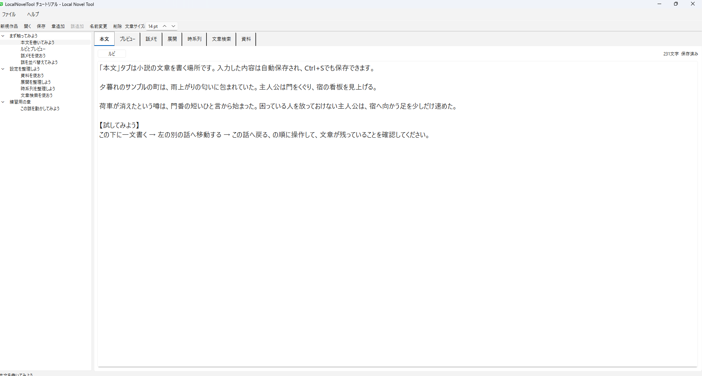
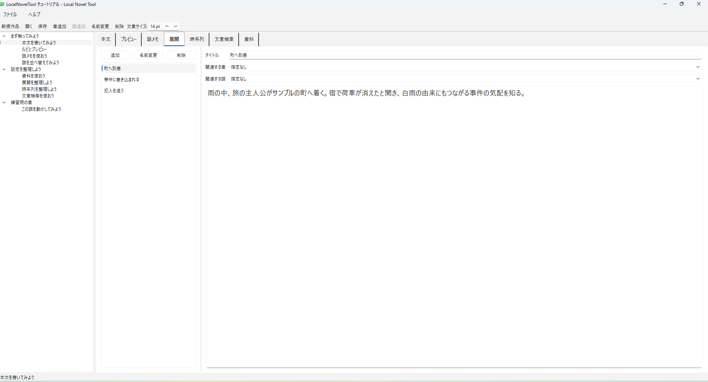
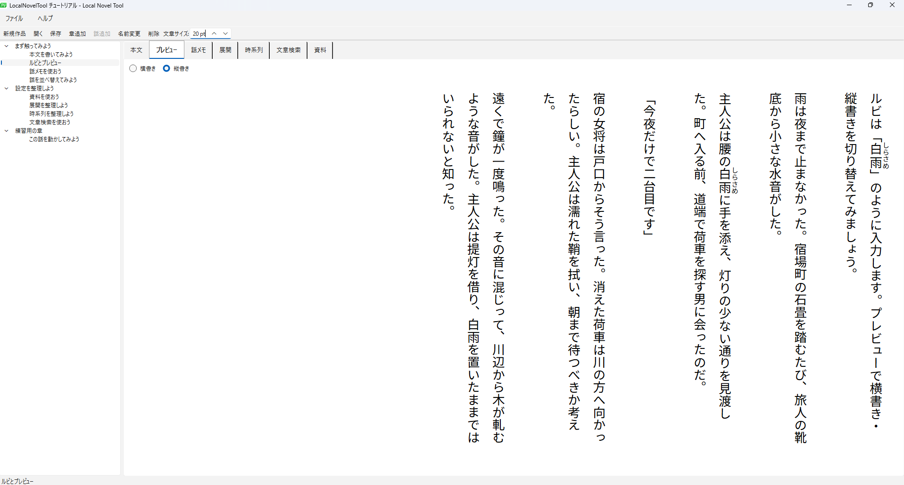

# LocalNovelTool

小説を書くことに集中するための、Windows向け・完全ローカルの執筆支援ツールです。

「この設定なんだっけ？」
「次の展開どうするんだっけ？」
をすぐ確認できることを重視しています。

原稿、話メモ、資料、展開、時系列を一つの作品として整理し、書く途中で
必要な情報へ戻りやすくします。文章を書かせるためではなく、書く人が
文章を書くこと以外で疲れないための道具です。

## こんな時に使えます

- 本文を書いている途中で、設定や話メモをすぐ確認したい
- プロット／展開や時系列を別ファイルから探したくない
- 「あの記述どこだっけ」を作品全体から検索したい
- 章や話をドラッグ＆ドロップで整理したい
- 縦書きで原稿を読み返したい
- オンラインサービスではなく、ローカルに作品を置いて管理したい

作品データは読みやすいUTF-8テキストとJSONで保存され、独自の不透明な
形式に閉じ込められません。

## Download

最新版は GitHub Releases からダウンロードできます。

ZIPを展開し、`LocalNovelTool.exe` を起動するだけで使用できます。
Pythonのインストールは不要です。

### Free版の更新

LocalNovelToolを終了し、新しいバージョンのファイルを既存の
`LocalNovelTool`フォルダへ上書きしてください。作品データはアプリ本体とは
別の場所に保存されます。

## 画面

### 本文を書く

左側の章・話ツリーから話を選んで本文を書けます。タブから話メモ、資料、
展開、時系列へ切り替えられます。本文は自動保存され、`Ctrl+S`でも手動保存
できます。

### 展開を整理する

展開は短い物語の流れメモとして使えます。章・話との関連付けは任意で、
ドラッグ＆ドロップで順序を入れ替えられます。次に何を書くかを確認したい
ときの一覧です。

### 縦書きで確認する

本文は横書き・縦書きのプレビューで読み返せます。`｜白雨《しらさめ》`の
ようなルビ記法に対応し、本文・メモなどの文章サイズは設定から変更できます。

## 主な機能

- 作品フォルダの新規作成 / 読み込み
- 初回起動時のチュートリアル作品
- 章・話の追加 / 名前変更 / 削除
- 章・話のドラッグ＆ドロップ並び替え
- 話の別章への移動
- 本文エディタ
- 自動保存と手動保存（ファイル > 保存 / `Ctrl+S`）
- 文字数表示
- ルビ記法 `｜白雨《しらさめ》`
- 横書き / 縦書きプレビュー
- 文章の文字サイズ設定
- 話メモ
- 登場人物 / アイテム / 世界観 / その他の資料管理
- 展開管理
- 時系列管理
- 本文 / 話メモ / 資料 / 展開 / 時系列の横断検索
- 検索結果から対象へ直接移動
- チュートリアル再作成
- 未保存編集を異常終了後に確認できるRecovery
- 作品の保存フォルダを設定から変更
- 完全ローカル動作

## 基本的な使い方

1. 「新規作品」で作品名を入力して作品を作成
2. 章と話を追加
3. 「本文」タブで執筆
4. 必要に応じて話メモ、資料、展開、時系列を確認
5. 「文章検索」で作品全体を横断検索

初回起動時には操作方法を確認できるチュートリアル作品が開きます。

## データ保存について

- 作品データは完全にローカルへ保存します。
- 新規作品は、設定中の「作品の保存フォルダ」へ保存します（初期値は
  `Documents\LocalNovelTool\作品\<作品名>`）。
- 以前のバージョンで任意の場所に作成した作品も「開く」から利用できます。
- 本文はUTF-8テキストで保持します。
- 作品構造はJSONで保持します。
- アプリが使用できなくなっても本文データを直接確認できます。
- Recoveryはアプリフォルダ側に保存され、異常終了後に復旧候補を確認できます。
- クラウド通信やAI機能は使用しません。

## 開発 / ビルド

使用技術:

- Python
- PySide6 / Qt
- pytest
- pyside6-deploy / Nuitka

Windows 10 / 11 x64向けです。詳細なビルド手順は [BUILD_WINDOWS.md](BUILD_WINDOWS.md) を参照してください。

## ライセンス

LocalNovelTool本体は [MIT License](LICENSE.txt) で提供します。
Python、PySide6、Qtその他の第三者コンポーネントは、それぞれのライセンスに従います。
詳細は [THIRD_PARTY_LICENSES.txt](THIRD_PARTY_LICENSES.txt)、[licenses](licenses)、
[CREDITS.txt](CREDITS.txt) を参照してください。
